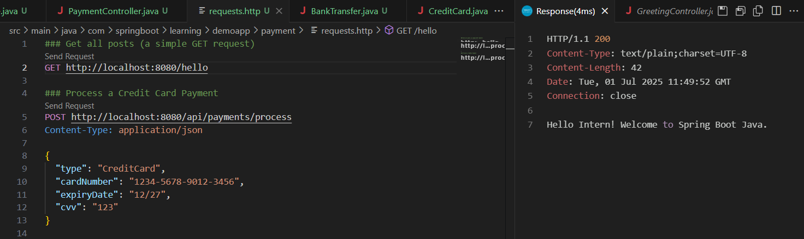
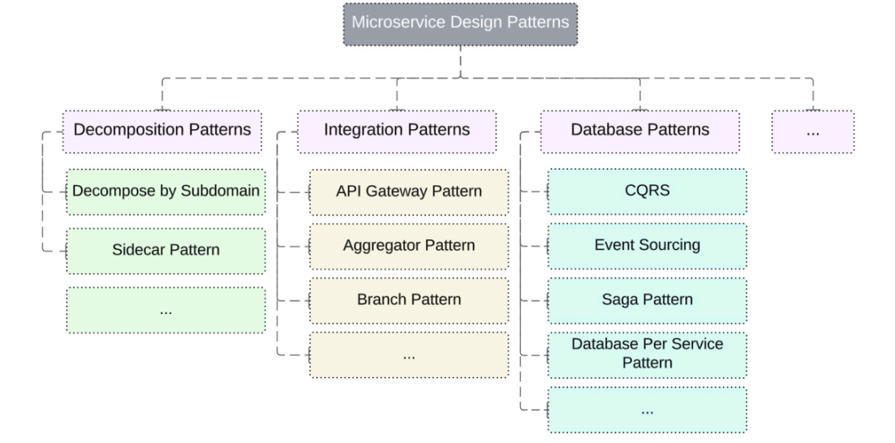
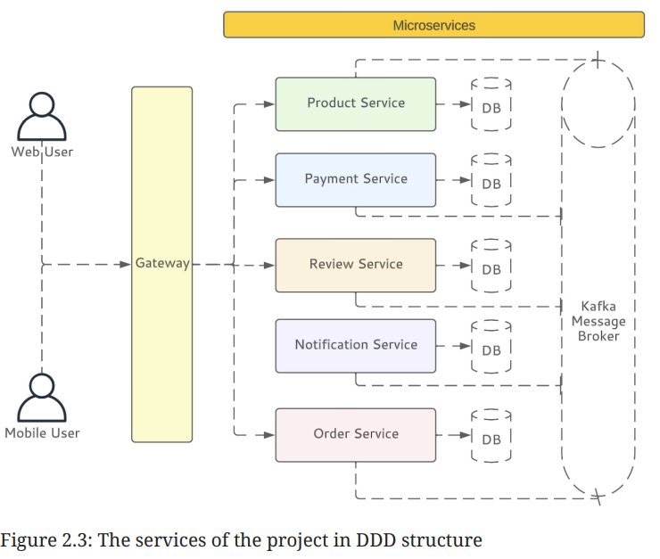
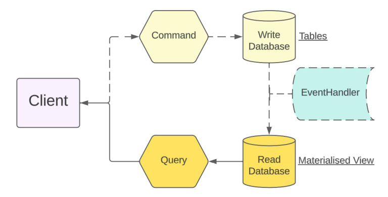
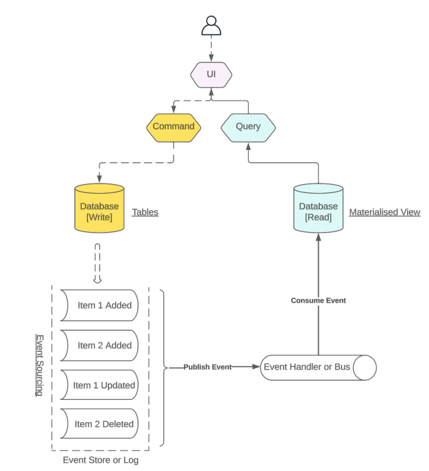
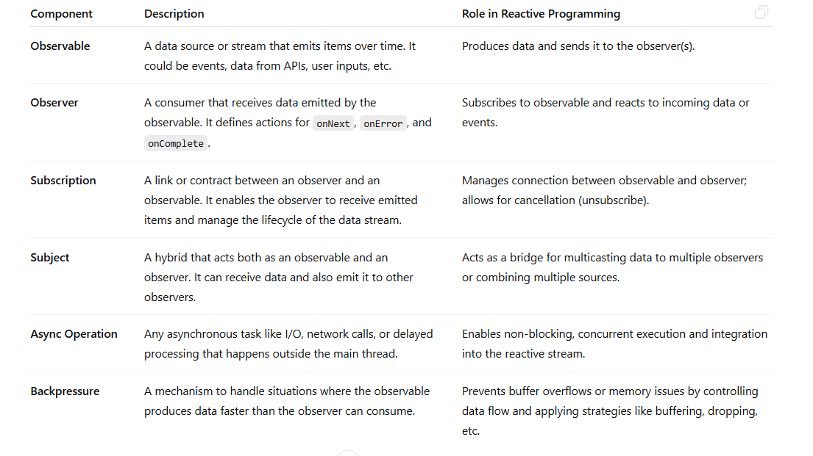
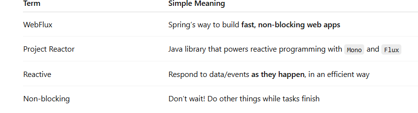

### Advantages of Spring boot 3.0
1.  It eliminates the need for boilerplate configuration, enabling you to concentrate on writing business logic. 
With Spring Boot’s auto-configuration and starter dependencies, you can set up a project in minutes rather than hours.

2. `Microservice ready`: Even when we design a Mean Valuable Product (MVP) for a small start-up idea, we are thinking in terms of a microservice structure, including asynchronous communication scalability, making it independently deployable, and ensuring flexibility.

3. `Streamlined configuration`: Spring Boot follows the “convention over configuration” philosophy, giving sensible defaults, and it provides automatic settings, which reduces the complexity of managing the settings.
Introducing a service or bean in XML configuration was complicated and hard to manage.
    

4. `Extensive ecosystem`: All complex projects need a database, messaging between components, and interactions with externel services. Spring ecosystem.

 - Support for diverse databases : One of the most important features of Spring Boot is that it makes the idea of the data access to and its management of SQL as well as NoSQL databases such as MySQL and MongoDB easier.

 - Messaging solutions: the compatibility of Spring Boot with the likes of Apache Kafka and RabbitMQ helps a
 great deal with efficient message queuing.

 - Spring Cloud for microservices: It helps in service discovery, load balancing, and distributed configuration by using the declarative programming model.

 - Security and authentication: Whether you want to implement OAuth 2.0 or JWT authentication or wish to apply access control
based on roles, Spring Boot has this covered as well.

- Application monitoring and management: Spring Boot Actuator, being an associated sub‐project of Spring Boot, provides built-in support for metrics gathering, health-check features, and management endpoints, and it is not difficult to add its functionality to your services.

5. `cloud-native capabilities`: Spring Boot has got great features such as scalability and elasticity for applications in such environments, which means our application will grow or shrink horizontally as per demand, plus we get
access to multiple managed services.

### Realworld problem solution with Sealed interface and Json Polymorphism with Jackson
Follow payment module code example 

### Realworld problem solution with GraalVM Support
Real-World Example: An application that took 3.6 seconds to start on a standard JVM was able to start in under 100 milliseconds once compiled using GraalVM Native Image. This makes Java a much more viable and competitive option for serverless functions.

### Microservice genric design patterns

https://docs.google.com/spreadsheets/d/1ARbP4d-0yCieaHnQ81dHSg9ChK_L_93s5eT7Ufkwg1c/edit?usp=sharing

### Microservice Patterns
1. Domain Driven Design (DDD)

2. Command Query Responsibility Segregation (CQRS)

3. Event Sourcing

### Reactive Programming 

#### Web Flux and Project Reactor

#### Implementing the Repository Layer & Model[Table]: 
1. In our `reactive user management service`, establishing a well-structured
`repository layer` is essential. This layer will liaise between our applica‐
tion’s business logic and the database, handling all data interactions.

2. We need to define our `database schema` and initial data in a
`schema.sql` file located in our resources directory.

3. However, in the reactive world, we use `ReactiveCrudRepository` or
`R2dbcRepository`. These interfaces are designed to work with reactive
types, such as `Mono` and `Flux`.

#### Implementing the Reactive REST Controller 

1. In a Spring Boot application, `controllers` are the `gatekeepers of our API`. It
navigates incoming requests to the appropriate services or actions. 

2. 